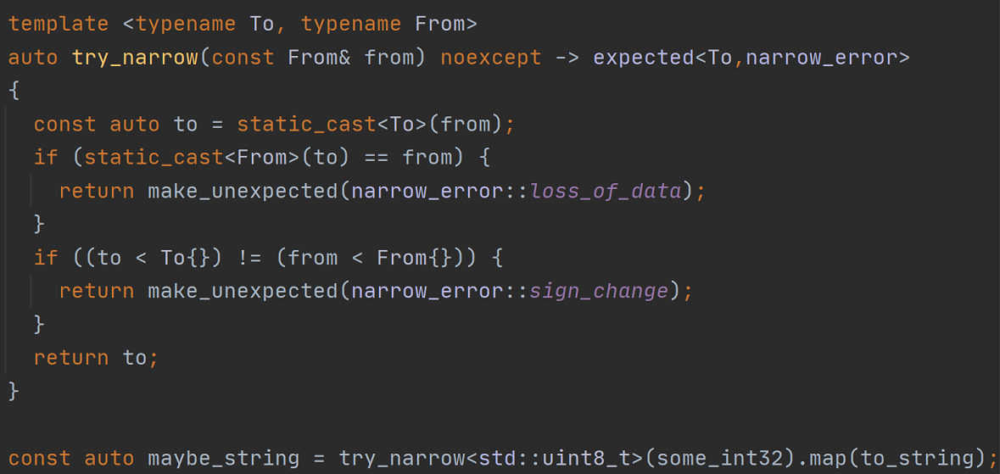

[](https://github.com/bitwizeshift/expected/actions)
[](https://www.codacy.com/gh/bitwizeshift/expected/dashboard?utm_source=github.com&amp;utm_medium=referral&amp;utm_content=bitwizeshift/expected&amp;utm_campaign=Badge_Grade)
[](http://github.com/bitwizeshift/expected/issues)
<br>
[](#tested-compilers)
[](https://raw.githubusercontent.com/bitwizeshift/expected/master/LICENSE)
[](https://bitwizeshift.github.io/expected/api/latest)
<br>
[](https://github.com/bitwizeshift/expected/releases)
[](https://bintray.com/bitwizeshift/Expected/Expected%3Aexpected/_latestVersion)

# Expected

**Expected** is a simple and light-weight error-handling mechanism that offers
a non-throwing alternative to conventional exception handling.



## Features

* [x] Offers a coherent, light-weight alternative to exceptions
* [x] Compatible with <kbd>C++11</kbd> (with more features in <kbd>C++14</kbd> and <kbd>C++17</kbd>)
* [x] Single-header, **header-only** solution -- easily drops into any project
* [x] No dependencies
* [x] Support for value-type, reference-type, and `void`-type values in `expected`
* [x] Monadic composition functions like `map`, `flat_map`, and `map_error` for
      easy functional use
* [x] [Comprehensively unit tested](test/src/expected.test.cpp) for both static
      behavior and runtime validation

For more details and examples on what is available in **Expected**, please
check out the [tutorial](doc/tutorial.md) section.

## Table of Contents

* [Background](#background) \
  A background on the problem **Expected** solves
* [Tutorial](doc/tutorial.md) \
  Some simple references of how to use **Expected**
* [API Reference](https://bitwizeshift.github.io/expected/api/latest/) \
  For doxygen-generated API information
* [Legal](doc/legal.md) \
  Information about how to attribute this project
* [How to install](doc/installing.md) \
  For a quick guide on how to install/use this in other projects
* [FAQ](doc/faq.md) \
  A list of frequently asked questions
* [Contributing Guidelines](.github/CONTRIBUTING.md) \
  Guidelines that must be followed in order to contribute to **Expected**

## Background

Error cases in C++ are often difficult to discern from the API. Any function
not marked `noexcept` can be assumed to throw an exception, but the exact _type_
of exception, and if it even derives from `std::exception`, is ambiguous.
Nothing in the language forces which exceptions may propagate from an API, which
can make dealing with such APIs complicated.

Often it is more desirable to achieve `noexcept` functions where possible, since
this allows for better optimizations in containers (e.g. optimal moves/swaps)
and less cognitive load on consumers.

Having an `expected<T, E>` type on your API not only semantically encodes that
a function is _able to_ fail, it also indicates to the caller _how_ the function
may fail, and what discrete, testable conditions may cause it to fail -- which
is what this library intends to solve.

As a simple example, compare these two identical functions:

```cpp
// (1)
auto to_uint32(const std::string& x) -> std::uint32_t;

// (2)
enum class parse_error { overflow=1, underflow=2, bad_input=3};
auto to_uint32(const std::string& x) noexcept -> expected<std::uint32_t,parse_error>;
```

In `(1)`, it is ambiguous _what_ (if anything) this function may throw on
failure, or how this error case may be accounted for.

In `(2)`, on the other hand, it is explicit that `to_uint32` _cannot_ throw --
so there is no need for a `catch` handler. It's also clear that it may fail for
whatever reasons are in `parse_error`, which discretely enumerates any possible
case for failure.

### Deviations from `std::expected` proposals

Although this library is heavily based on the `std::expected` proposal, it's
important to be aware that this handles a few things differently from what is
described in `P0323`. These deviations are outline below

1. This does not implement `emplace` functions, since this functionality is
   seen as orthogonal to the goals of `expected`, which should not be to
   arbitrarily be an `either<T,E>` type

2. `expected` has been given support for reference `T` types, so that this may
   behave as a consistent vocabulary type for error-handling

3. `unexpected` has been given support for reference `E` types, in order to
   avoid expensive construction of objects only used for comparisons

4. Assignment operators are only enabled if the corresponding constructors are
   marked `noexcept`. This deviates from `std::expected`'s proposal of
   introducing an intermediate object to hold the type during assignment.

5. Rather than allowing direct referential access to the underlying error,
   `expected::error()` _always_ returns a value that acts as the result's
   status. The defaut-constructed state of `E` is always considered the "good"
   state (e.g. `std::error_code{}`, `std::errc{}`, etc). This reduces the
   number of cases where this API may throw an exception to just `value()`

6. Rather than using `unexpect_t` to denote in-place construction of errors,
   this library uses `in_place_error_t`. This is done to prevent having 3 types
   that all sound similar (`expected`, `unexpected`, `unexpect_t`)

## Building the Unit Tests

Building the unit tests are not necessary to use this project. However, if
you want to contribute to the project or simply test it yourself, you will need
the following installed:

* [CMake](https://cmake.org): Used for configuring/building the project
* [Catch2](https://github.com/catchorg/Catch2): the unit-test library

Additionally, you will need to toggle the `EXPECTED_COMPILE_UNIT_TESTS` option
during cmake configuration to ensure that unit tests configure and build.

The easiest way to install Catch2 is using the [`conan`](https://conan.io/index.html)
package manager and installing with `conan install <path to conanfile>` from your
build directory.

A complete example of configuring, compiling, and running the tests:

```sh
# Make the build directory and enter it
mkdir build && cd build
# Install Catch with conan (optional)
conan install ..
# Configure the project
cmake .. -DEXPECTED_COMPILE_UNIT_TESTS=On
# Build everything
cmake --build .
# run the tests
cmake --build . --target test
```

## License


**Expected** is licensed under the
[MIT License](http://opensource.org/licenses/MIT):

> Copyright &copy; 2017 Matthew Rodusek
>
> Permission is hereby granted, free of charge, to any person obtaining a copy
> of this software and associated documentation files (the "Software"), to deal
> in the Software without restriction, including without limitation the rights
> to use, copy, modify, merge, publish, distribute, sublicense, and/or sell
> copies of the Software, and to permit persons to whom the Software is
> furnished to do so, subject to the following conditions:
>
> The above copyright notice and this permission notice shall be included in all
> copies or substantial portions of the Software.
>
> THE SOFTWARE IS PROVIDED "AS IS", WITHOUT WARRANTY OF ANY KIND, EXPRESS OR
> IMPLIED, INCLUDING BUT NOT LIMITED TO THE WARRANTIES OF MERCHANTABILITY,
> FITNESS FOR A PARTICULAR PURPOSE AND NONINFRINGEMENT. IN NO EVENT SHALL THE
> AUTHORS OR COPYRIGHT HOLDERS BE LIABLE FOR ANY CLAIM, DAMAGES OR OTHER
> LIABILITY, WHETHER IN AN ACTION OF CONTRACT, TORT OR OTHERWISE, ARISING FROM,
> OUT OF OR IN CONNECTION WITH THE SOFTWARE OR THE USE OR OTHER DEALINGS IN THE
> SOFTWARE.

## References

* [P0323R9](http://www.open-std.org/jtc1/sc22/wg21/docs/papers/2019/p0323r9.html):
  `std::expected` proposal was used as an inspiration for the general template
  structure
